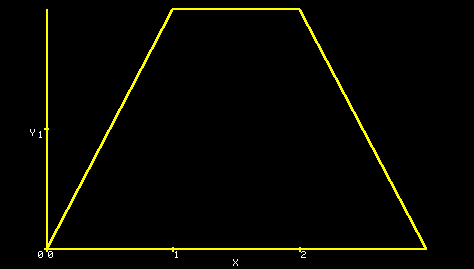
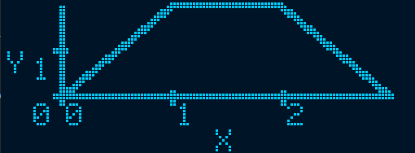
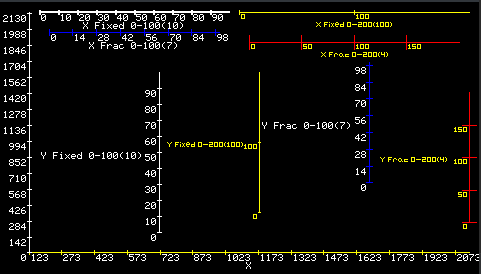

# Embedded Plots
 Heapless plotting library for small embedded targets, based on [embedded-graphics](https://crates.io/crates/embedded-graphics)
 crate.

 Thanks to basing it on `embedded-graphics` crate the library is very portable out of the box.
 It is not dependent on any hardware target.
 To throw it into your project, you only need to have a display that implements `DrawTarget` trait.
 For more details see [DrawTarget](https://docs.rs/embedded-graphics/latest/embedded_graphics/prelude/trait.DrawTarget.html) docs.

 Bonus feature of `embedded-graphics` is the simulator.
 You can use it to develop your plots without your target hardware, easily create documentation and so on.

 Library utilizes builder pattern and type states - it allows easy separation of the data and decoration in the target application.

 ## Examples
 ### Single plot
 Simple plot example
 #### On color display:
 
 #### On monochromatic display:
 

 Code to render:
 ```rust
 use embedded_plots::curve::{Curve, PlotPoint};
 use embedded_plots::single_plot::SinglePlot;
 use embedded_plots::axis::Scale;
 use embedded_graphics::geometry::{Point, Size};
 use embedded_graphics::pixelcolor::{RgbColor, Rgb565};
 use embedded_graphics::drawable::Drawable;

 //simulator dependencies, aka screen driver
 use embedded_graphics_simulator::SimulatorDisplay;

 let mut display: SimulatorDisplay<Rgb565> = SimulatorDisplay::new(Size::new(480, 272));
 let data = vec![
         PlotPoint { x: 0, y: 0 },
         PlotPoint { x: 1, y: 2 },
         PlotPoint { x: 2, y: 2 },
         PlotPoint { x: 3, y: 0 },
     ];
 let curve = Curve::from_data(data.as_slice());

 let plot = SinglePlot::new(
     &curve,
     Scale::RangeFraction(3),
     Scale::RangeFraction(2))
 .into_drawable(
     Point { x: 50, y: 10 },
     Point { x: 430, y: 250 })
 .set_color(RgbColor::YELLOW)
 .set_text_color(RgbColor::WHITE);

 plot.draw(&mut display).unwrap();
 ```

 ### Axis
 You can also use axis on its own, it looks like this:
 
 Code to render example axis:
 ```rust
 use embedded_plots::axis::{Axis, Scale, Placement};
 use embedded_graphics::pixelcolor::{RgbColor, Rgb565};
 use embedded_graphics::drawable::Drawable;
 use embedded_graphics::geometry::Size;

 //simulator dependencies, aka screen driver
 use embedded_graphics_simulator::SimulatorDisplay;
 use embedded_graphics::style::TextStyleBuilder;
 use embedded_graphics::fonts::Font6x8;

 let mut display: SimulatorDisplay<Rgb565> = SimulatorDisplay::new(Size::new(480, 272));

 let text_style_white = TextStyleBuilder::new(Font6x8)
     .text_color(RgbColor::WHITE)
     .build();
 Axis::new(0..100)
     .set_title("Title")
     .set_scale(Scale::Fixed(10))
     .into_drawable_axis(Placement::X { x1: 40, x2: 230, y: 10 })
     .set_text_style(text_style_white)
     .set_color(RgbColor::WHITE)
     .draw(&mut display).unwrap();
 ```
 For more details, see `free_axis` example

 ## Current limitations and future plans
 This is very beginning of the development, however it is functional to the point where single plot can be drawn.

 Main issue for now is that you need to predict on how much space will be occupied by axis ticks,
 numbers and titles, points passed to `.into_drawable()` are the boundaries for which curve is scaled.
 This will be fixed, please be prepared for it since it might be a breaking change for you.

 #### Main features planned soon:
 * Drawing multiple curves that share the same X and Y domains on a single plot (take curves slice instead of single curve)
 * Dual plot - drawing curves that have two separate domains (either only on one axis or both).
   Axis on both sides, left and right (or top and bottom) will be drawn with color corresponding to plot
 * Support for floating point domains
 * Support for fixed point curve data with intermediate floating point scales (to avoid floating point calculations for each drawn point)

 #### Features I'd love to see in the future:
 * Partial redrawing - possibility to substitute data and detect which parts of the screen needs to be redrawed
 * Oscilloscope style live mode (adding new points without any redrawing, no data retention)
 * Cursors - manual and math based (max,min,avg and so on...)

 ## Contributions
 Contributions are more than welcome, if you have particular improvement, raise an issue or submit merge request on project's Gitlab page.

 If you just want to help but don't have anything specific in mind, please take a look at [issue tracker](https://gitlab.com/mchodzikiewicz/embedded-plots/-/issues) and pick one.
